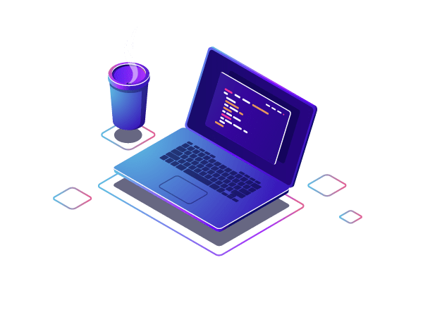

<h1 align="left">Hi , I'm Alisson</h1>

  

- ⚡ A passionate software development and promoting digital experiences.

- 💼 I’m currently working at [Capgemini](https://www.capgemini.com/)

- 👨‍💻 All of my projects are available at [alissonmgsantos](https://alissonmgsantos.vercel.app/)

- 💬 Ask me about **JavaScript, HTML, CSS, SQL, Node.JS**

  

## 🛠 &nbsp;Tech Stack

&nbsp;
&nbsp;
&nbsp;
&nbsp;
&nbsp;
&nbsp;
&nbsp;
&nbsp;

  

## 📊 &nbsp;GitHub Analytics

## 🌐 &nbsp;Social Links

  

